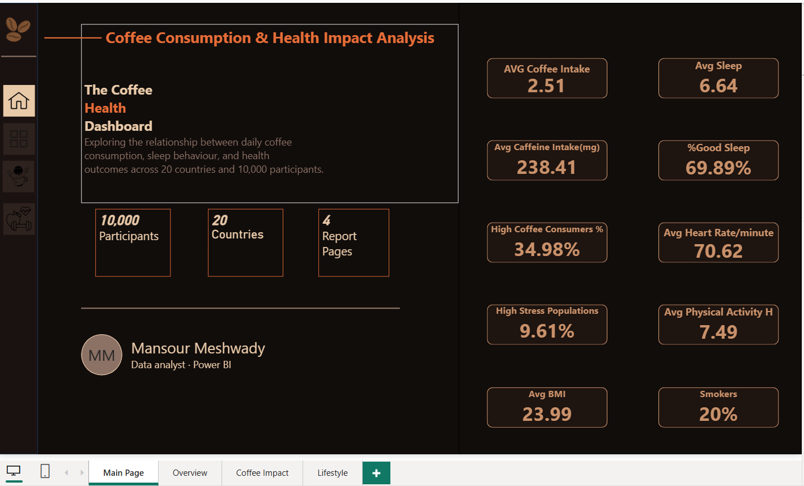
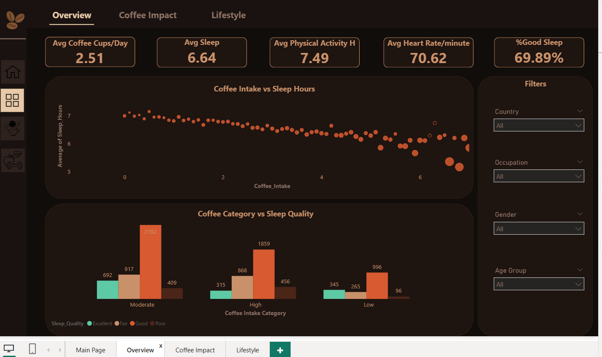
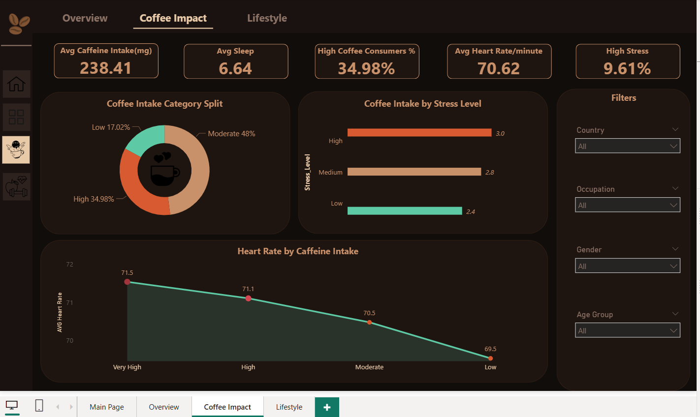
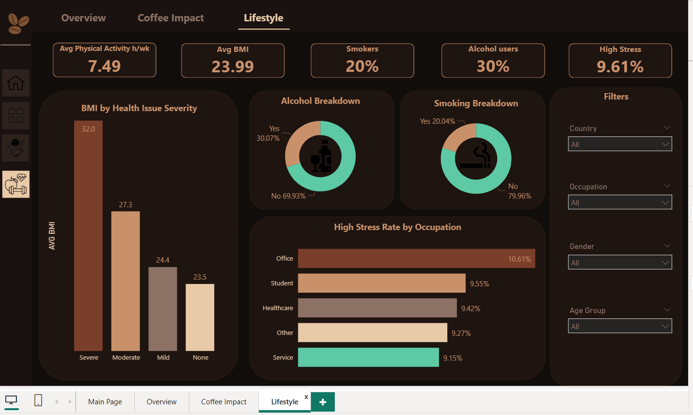

# ☕ Coffee Consumption & Health Impact Analysis

## 📌 Project Overview

This project explores the relationship between coffee consumption, caffeine intake, sleep behavior, physical activity, and overall health outcomes using Power BI.

The dashboard analyzes data from 10,000 participants across 20 countries, uncovering patterns between lifestyle habits and health indicators such as sleep quality, BMI, heart rate, stress levels, smoking, and alcohol consumption.

---

## 🎯 Business Objective

The goal of this project is to answer key questions such as:

- Does higher coffee consumption affect sleep duration?
- How does caffeine intake relate to heart rate?
- Are highly active individuals healthier?
- What lifestyle factors are associated with stress levels?
- How do smoking and alcohol habits relate to health outcomes?

---

## 🛠 Tools Used

- Power BI
- Power Query
- DAX
- Data Modeling
- Data Visualization

---

## 📊 Dashboard Pages

### 1️⃣ Overview

Provides a high-level summary of coffee consumption and health metrics.

Key KPIs:
- Average Coffee Intake
- Average Sleep Hours
- Average Physical Activity
- Average Heart Rate
- Good Sleep Percentage

Main Insights:
- Coffee intake shows a negative relationship with sleep duration.
- Moderate coffee consumers demonstrate the best sleep quality distribution.

---

### 2️⃣ Coffee Impact

Focuses on the effects of coffee and caffeine consumption on health indicators.

Key Analysis:
- Coffee Intake Category Distribution
- Coffee Intake by Stress Level
- Caffeine Intake Category vs Heart Rate

Main Insights:
- Higher caffeine consumption is associated with elevated heart rates.
- High coffee consumers represent approximately 35% of participants.

---

### 3️⃣ Lifestyle

Analyzes lifestyle behaviors and their relationship to health outcomes.

Key Analysis:
- BMI by Health Issue Severity
- Alcohol Consumption Distribution
- Smoking Distribution
- Stress Level by Occupation

Main Insights:
- Severe health issues are associated with significantly higher BMI levels.
- Office workers exhibit the highest stress levels among occupations.
- Smoking prevalence remains relatively low across the sample population.

---

## 📷 Dashboard Preview

### Main Page

### Overview

### Coffee Impact

### Lifestyle

---

## 📈 Key Findings

- Average daily coffee consumption is 2.51 cups.
- Average sleep duration is 6.64 hours.
- Approximately 70% of participants report good sleep quality.
- High coffee consumers account for nearly 35% of the population.
- Average BMI is 23.99.
- High stress affects approximately 9.6% of participants.

---

## 🧠 Skills Demonstrated

- Data Cleaning
- Data Transformation
- DAX Calculations
- Data Modeling
- Dashboard Design
- KPI Development
- Storytelling with Data
- Business Intelligence

---

## 👨‍💻 Author

### Mansour Meshwady

Data Analyst | Power BI Developer

LinkedIn:
www.linkedin.com/in/mansour-meshwady-4ab5a027b

Email:
mansourmishwady@gmail.com

---

⭐ If you found this project useful, consider giving it a star.
